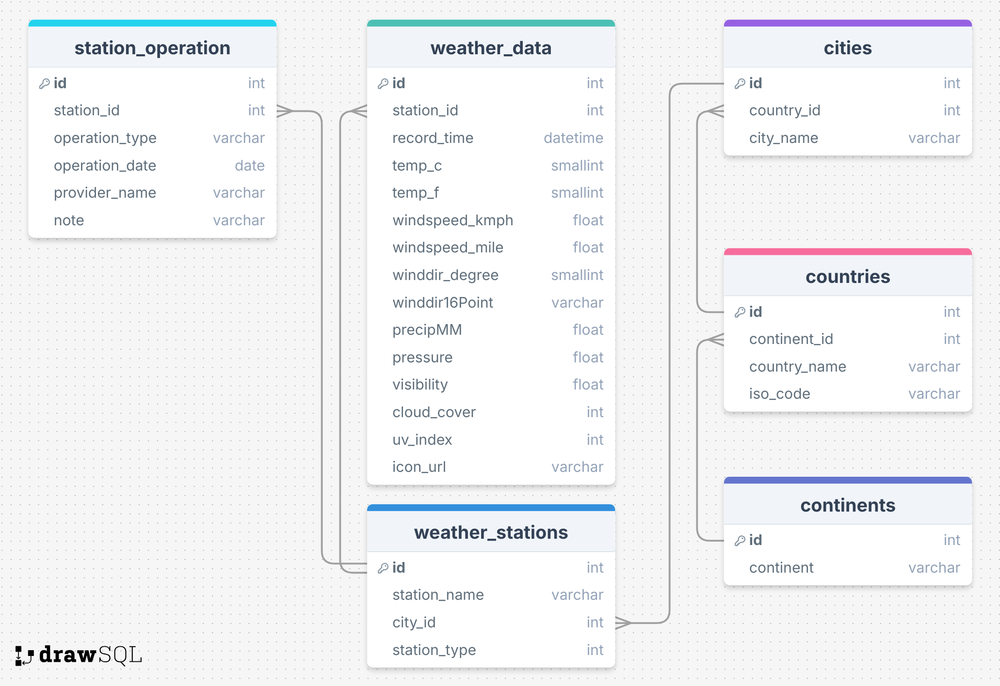

# Real-time Weather Data Pipeline

## 📌 Overview

This project implements a real-time data pipeline to collect, process, and store weather data. The system uses Apache Airflow to schedule periodic API calls, Kafka to transport messages, Spark Streaming to process data, and MySQL to store the final results.

## 🚀 Setup Guide

For full setup instructions and deployment steps, please visit:

➡️ [View Setup Guide](./SETUP.md)

## 🧱 Architecture


## 📦 Technologies Used

- **Apache Airflow** – Orchestrates and schedules hourly DAGs to fetch weather data.
- **Apache Kafka** – Acts as a real-time message queue for streaming data.
- **Apache Spark Streaming** – Processes data from Kafka and transforms it before storage.
- **AWS S3** – Stores raw data as backups for auditing and recovery purposes.
- **MySQL** – Stores the final structured weather data for analysis or querying.
- **World Weather Online API** – Provides real-time weather data via RESTful requests.

## 🧾 API Sample Data

The weather data is fetched from the [World Weather Online API](https://www.worldweatheronline.com/).

Example JSON snippet:

```text
{
     "data": {
         "current_condition": [{
         "temp_C": "33",
         "temp_F": "33",
         "windspeedKmph": "12",
         "pressure": "1010",
         "humidity": "62",
         "observation_time": "07:00 AM"
         ...
     }]
    ...
 }
}
```

## 🗃️ Database Schema Design



#### 🔄 DAG Task Flow

Each weather station is represented by a dedicated Airflow DAG.  
In this example, the DAG `hanoi_vietnam_station_dag_1` fetches, stores, and streams weather data for **Hanoi, Vietnam** every hour.

It includes 3 tasks:

1. **Fetch Weather Data**  
   
   - Calls the weather API and extracts relevant fields.
   - Adds metadata such as `station_id` and `record_time`.

2. **Upload to S3**  
   
   - Saves the JSON data to an S3 bucket.
   - The filename is timestamped and includes location info.

3. **Send to Kafka**  
   
   - Sends the weather data to a Kafka topic (`weather_topic`) for downstream streaming.

➡️ [View full DAG code](./airflow/hanoi_weather_station_n1_dag.py)

## ⚡ Spark Streaming Pipeline

This Spark Structured Streaming job reads real-time weather data from Kafka, transforms it, and stores the result into a MySQL database.

### 🔌 Kafka Source

- Reads streaming data from the Kafka topic: `weather_topic`
- Kafka messages are serialized in JSON format
- A custom schema is used to parse each weather record

### 🔄 Transformations

- Parses the JSON and extracts nested fields (e.g., `weatherIconUrl[0]["value"]`)
- Converts string fields into appropriate types, example:
  - `temp_C` → `smallint`
  - `windspeedKmph` → `float`
  - `record_time` → `timestamp`
- Filters out records with missing timestamps

### 🗃️ MySQL Sink

- Uses `foreachBatch` to write micro-batches into a MySQL table named `weather_data`
- JDBC connection parameters are provided directly
- Appends new rows to the database as data streams in

➡️ [View full Spark streaming code](./spark/spark_streaming.py)

## 📜 License

This project is licensed under the [Creative Commons Attribution-NonCommercial 4.0 International License](LICENSE).

## 👤 Author & Contact

**Duong Binh Minh**  
Bachelor's Student in Information Technology – University of Engineering and Technology, Vietnam National University  
📫 Academic Email: [21020778@vnu.edu.vn](mailto:21020778@vnu.edu.vn)  
📫 Personal Email: [minimum.195422@gmail.com](mailto:minimum.195422@gmail.com)  